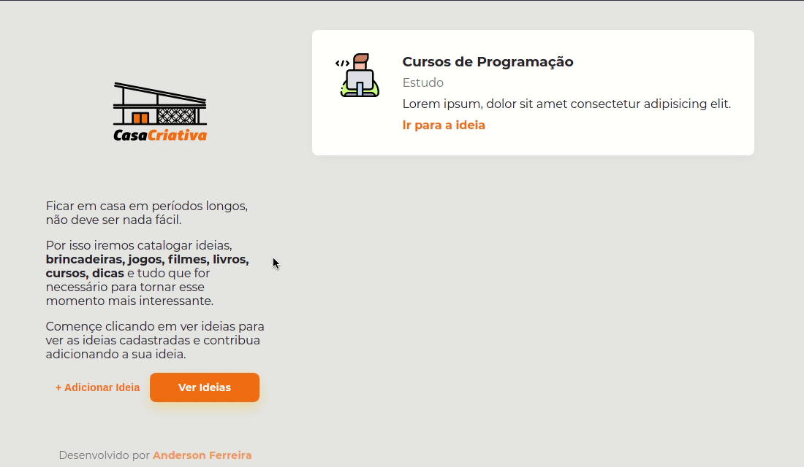

<h1 align="center">Projeto Casa Criativa</h1>

Casa Criativa é um projeto para cadastrar ideias de estudo e outras atividades para fazer nesse período de pandemia.

## Tecnologias utilizadas:

- [Node.js](https://nodejs.org/en/)
- [Javascript](https://developer.mozilla.org/)
- [HTML 5](https://developer.mozilla.org/pt-BR/docs/Web/HTML)
- [CSS 3](https://developer.mozilla.org/pt-BR/docs/Web/CSS)
- [Sqlite](https://www.sqlite.org/index.html)

## Como Utilizar

- Clone o projeto no seu computador
- Instale as dependências com o comando (npm install)
- Acesse no navegador no (http://localhost:3000)

Projeto feito para aprende de forma prática dos conceitos de HTML, CSS e JS.

